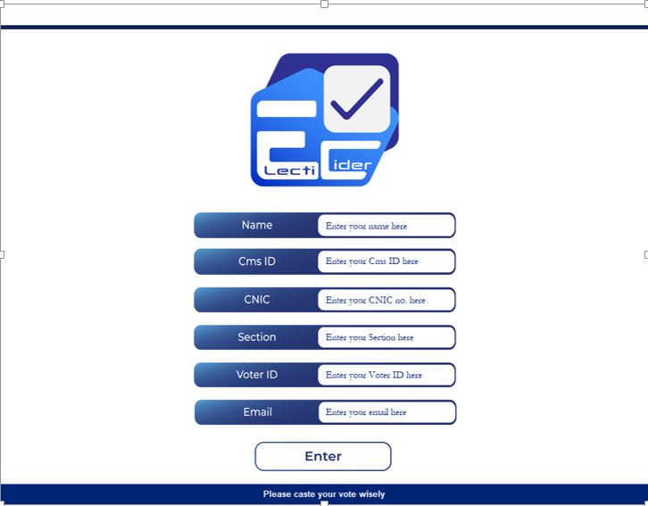
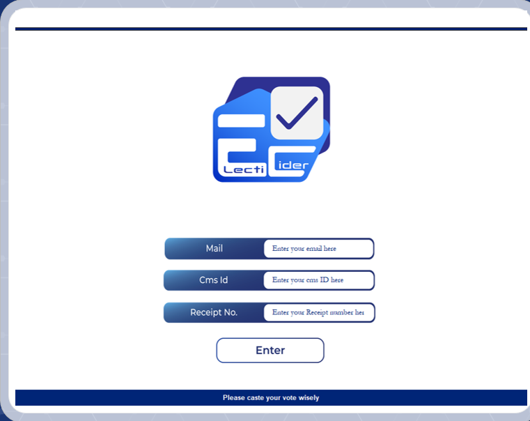
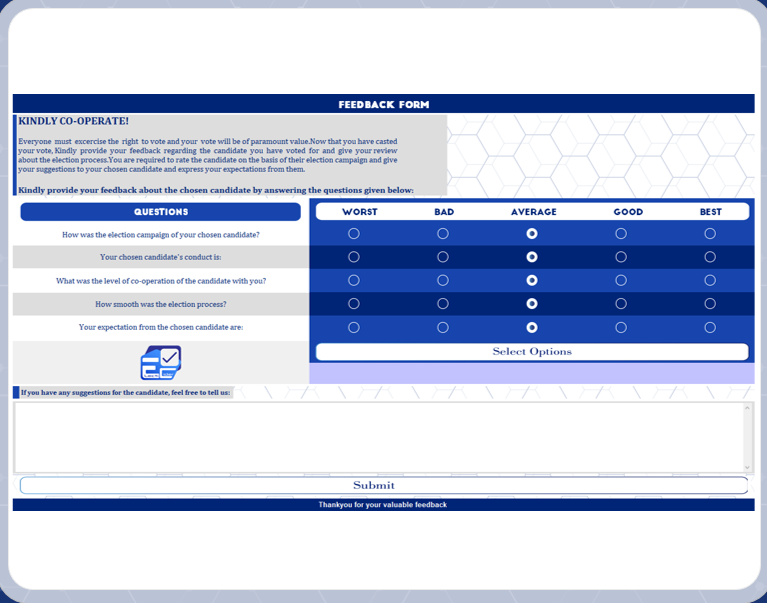

# ELECTICIDER
ELECTICIDER is a desktop application created with tkinter, a commonly used GUI framework for python.
Its name is the amalgamation of two words ‘ELECTION’ and ‘DECIDER’ . Although it is not a web application but it does need constant internet access.
It has been originally designed to conduct on-campus elections where the candidates are students. Its development was aimed at encouraging the students
to caste their votes by ensuring transparency and it intrduces a unique authentication method.

# Receipt generator

There are two parts of this application. One runs at the receipt counter. The coder for this part is present in the Login folder.
This is where the user enters the credentials such as name, email, student ID etc. Upon verification of the credentials, a unique 6 digit voter ID
is generated which is sent to the student through an email.

# Login booth

The second part of the application runs at the voting booth where the user logs in by entering the email, student ID and the voter ID
recieved through an email. The user is asked to caste the vote and submit the feedback in the end.The code for this part is present in
the folder named Booth.

# Main window and feedback form

  

I worked on this as my semester project during the first semester of my degree. Therefore, the code is a bit messy.
Detailed working is present in the ppt file present in the repository.
